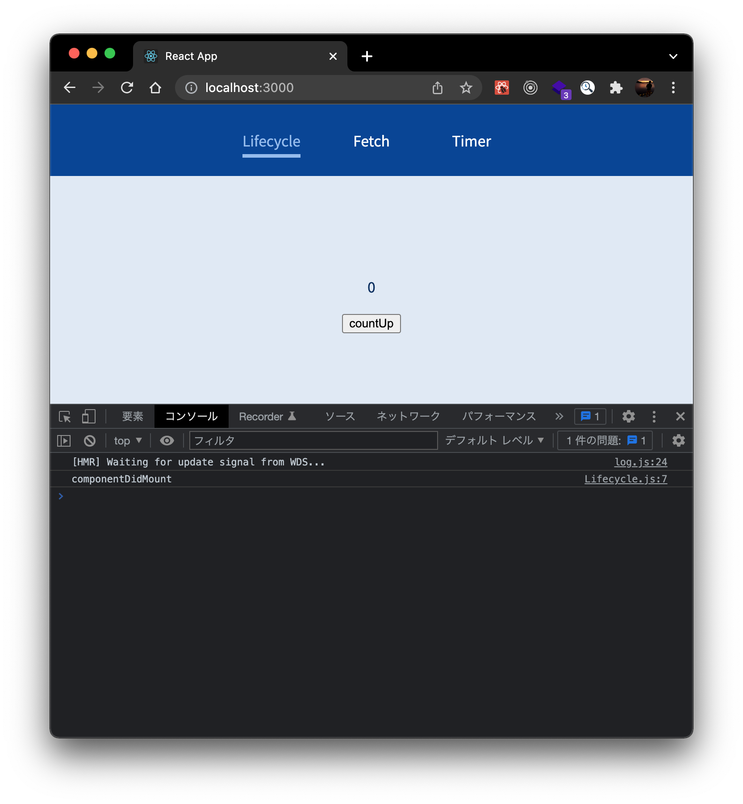
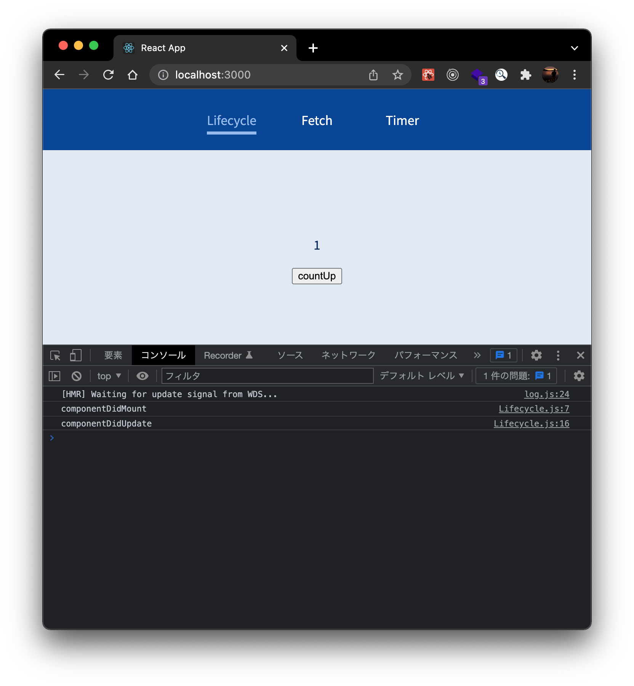
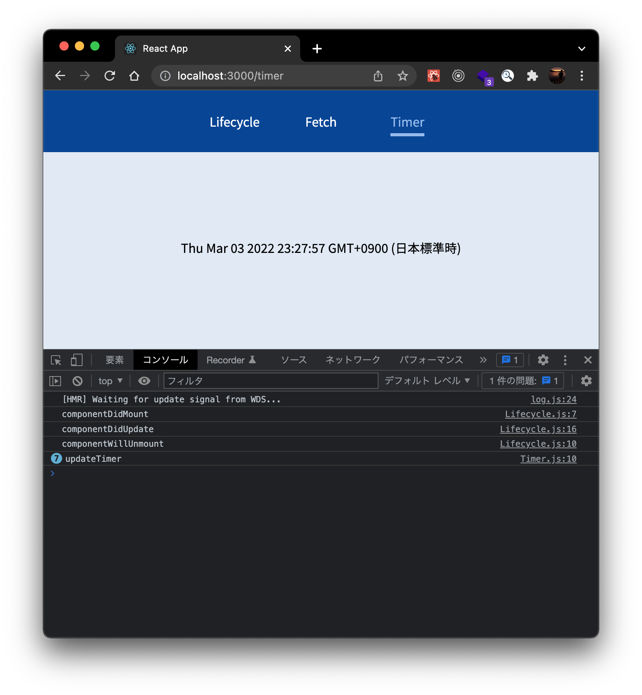

# React のライフサイクルについて

## 目次

1. [React の状態の種類](#reactの状態の種類)
2. [各ページのライフサイクルについて](#各ページのライフサイクルについて)
3. [実行時画像](#処理の流れ)

- [ソースコード](https://github.com/mmasap/react-lifecycle-sample)
  - 実行手順
  1. `npm i`
  2. `npm start` 

## React の状態の種類

- componentDidMount: DOM として描画されるとき
- componentDidUpdate: DOM が再描画されるとき
- componentWillUnmount: DOM が削除されるとき

## 各ページのライフサイクルについて

### Lifecycle.js

状態が変更された場合に実行したい処理は、useEffect 関数を使用して実行する。

```js
useEffect(() => {
  console.log('componentDidMount'); // マウント時に実行される処理

  return () => {
    console.log('componentWillUnmount'); // アンマウント時に実行される処理
  };
}, []); // 第2引数が空配列の場合、初回マウント時のみ実行される

useEffect(() => {
  if (count === 0) return; // 初回マウント時は処理をスキップする
  console.log('componentDidUpdate'); // 更新時に実行される処理
}, [count]); // 第2引数に値が設定されている場合、値が更新されたときに更新処理が実行される
```

### Fetch.js

マウント時に非同期処理を呼び出し、レスポンスが帰ってきたら State を更新し、再レンダリングを行う。

```js
useEffect(() => {
  fetch('https://jsonplaceholder.typicode.com/users')
    .then((response) => response.json())
    .then((data) => setUsers(data)); // レスポンスが返却されたらstateを更新
}, []); // マウント時のみ実行
```

### Timer.js

マウント時にタイマーをセットし、1 秒ごとにステートを更新し再レンダリングしている。
setIntervalはグローバル空間で処理されるため、アンマウントした場合でも処理が残り続ける。
そのため、アンマウント時に clearInterval で明示的にリソースを開放する必要がある。
clearInterval 処理をコメントアウトした場合に、Timer 画面から別画面に遷移してもコンソールログが出力され続けることが確認できる。

```js
useEffect(() => {
  const interval = setInterval(() => {
    console.log('updateTimer');
    setTimer(new Date()); // ステートを更新
  }, 1000);

  return () => clearInterval(interval); // アンマウント時に呼び出し
}, []); // マウント時のみ実行
```

### Lifecycle.js　

初回表示(componentDidMount)

"count up"ボタン押下(componentDidUpdate)

"Fetch.js"にページ遷移(componentWillUnmount)


### Tiemr.js

初回表示, 時間経過(componentDidMount, componentDidUpdate)

"Lifecycle"ページに画面遷移(componentWillUnmount)

